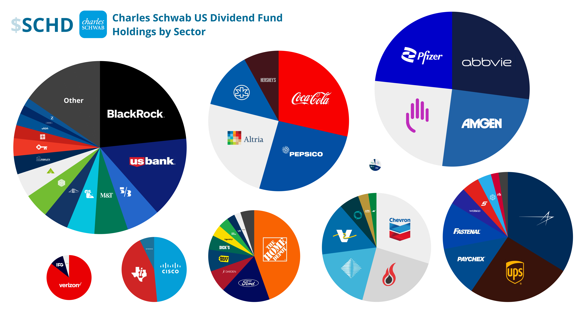
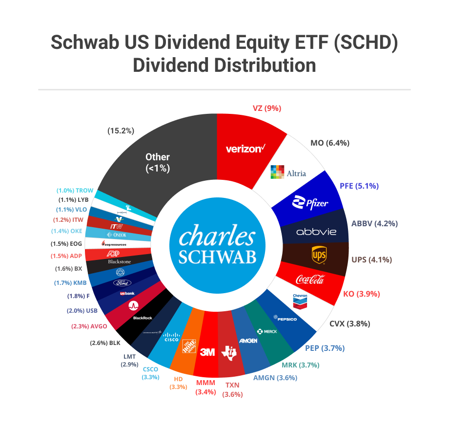
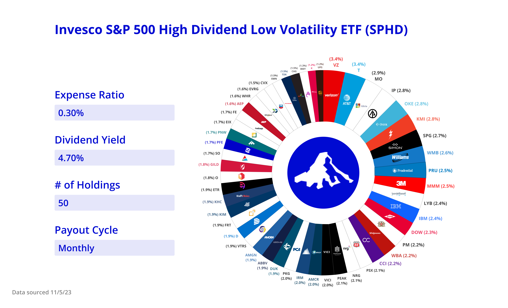
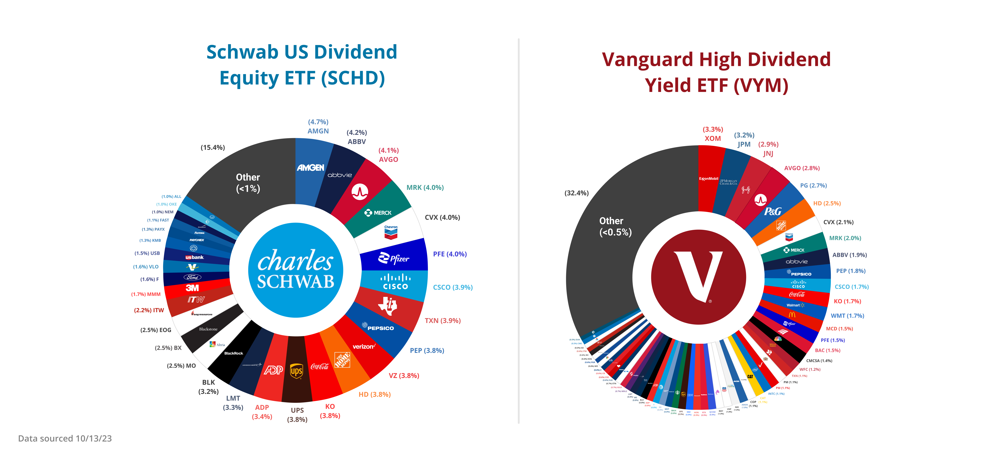
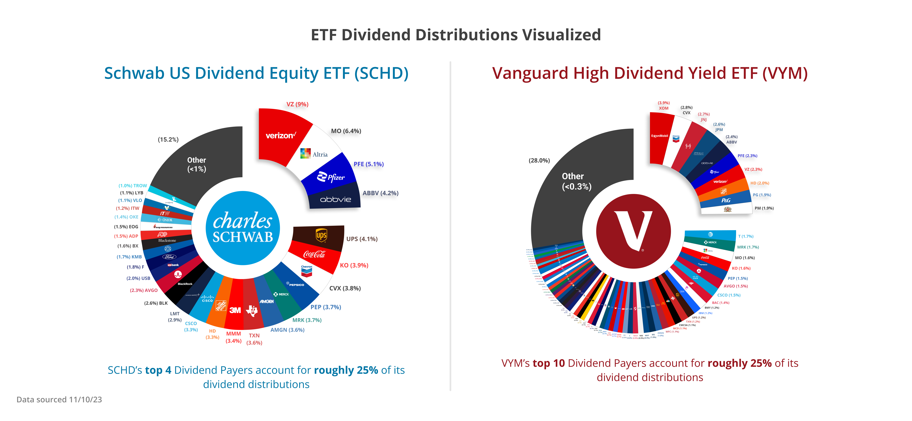
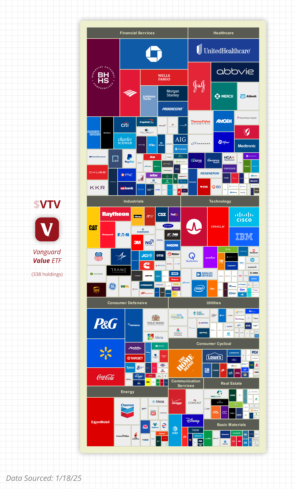
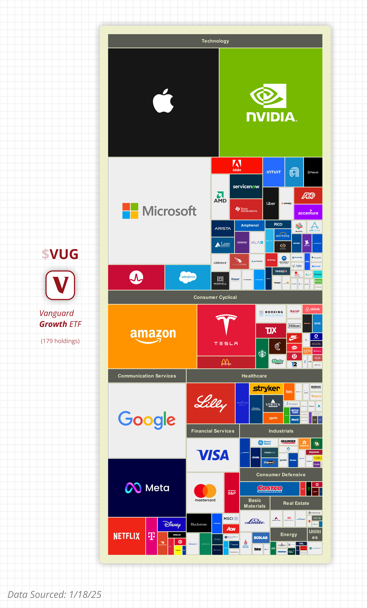

# stock-diagrams
These are some stock diagrams I made in Figma. Check out the [figma source](https://www.figma.com/design/mC7U7iYB4Lk4OJfeFtgdPl/Stock-Diagrams?node-id=0-1&t=axN3veDtOCo8Sp2a-1) if you wanna see how these were made
# Diagrams
## SCHD
### Bubble Map by Sector (unknown source date)

### Dividend Distribution (unknown source date)

## SPHD
### Portfolio Composition

### Bubble Map by Sector

## SCHD vs VYM
### Portfolio Composition

### Dividend Distribution

## VTV vs VUG
### $1 visualized comparison

### $1 invested in VTV

### $1 invested in VUG

